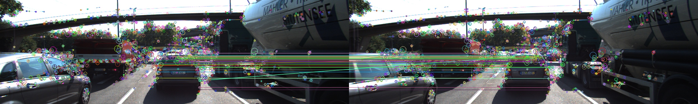
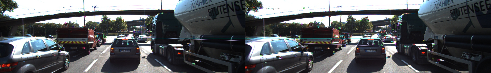
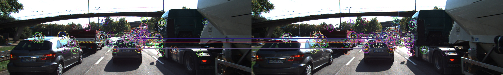
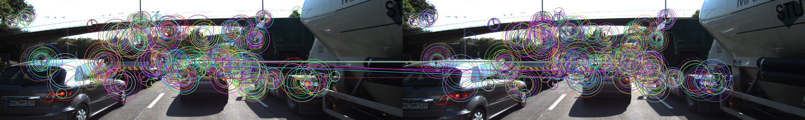

## MP.1 Match 3D Objects

camFusion_student.cpp:258-348

Function will iterate over all previous and current BB combination, and count number of matches that fills both BB. Highest number of matches will be taken as a BB match.

Another safety guard is included such that if the previous and current BB best match are too different in BB area size, they will not be considered as BB match (camFusion_student.cpp:310-320)

Multithreading is also employed to speed iteration over all BB combinations

## MP.2 Compute Lidar-based TTC

camFusion_student.cpp:207-256

First the lidar points are sorted based on their x-dir values. Then outliers are removed using Inter-Quartile Range (IQR) method, whereby any points greater than 1.5xIQR from the median are removed

The closest point after IQR filtering is picked for TTC calculation

## MP.3 Associate Keypoint Correspondences with Bounding Boxes

camFusion_student.cpp:140-151

## MP.4 Compute Camera-based TTC

camFusion_student.cpp:153-205

First, the squared distance ratios of the prev and curr keypoints matches in the BB are calculated and stored in a vector. NaN results are discarded. In total n(n-1)/2 ratios will be calculated, where n is number of keypoint matches

Next the vector of ratios is sorted and filtered with IQR, similar to Lidar TTC

The average ratio is calculated and is used for TTC camera calculation

## MP.5 Performance Evaluation 1

Raw data is located at `dat/experiment-data/results.ods`

TTC Lidar in general is quite consistent, with values averaging 12.5 secs with stdev of 3.4 secs. Although we do not expect the TTC to be the same at every frame, stdev still provides a good estimate of the consistency of the detection as we do not expect the values to differ greatly between the period of 1.8 secs.

The Lidar TTC has a lot of noise because the delta distance between the frames are in the range of 4 to 10cm, while the lidar used have accuracy of <2cm. Hence the noise from the lidar measurement can have significant impact on the TTC estimate

## MP.6 Performance Evaluation 2

Raw data is located at `dat/experiment-data/results.ods`

TTC camera has wildly different results depending on the detector descriptor combination, overall the  values averages 4.9 secs with stdev of 99.5 secs.

**Best detector descriptor combination**

AKAZE as detector and ORB as descriptor gave the best result in this experiment because:

1. It has consistent TTC calculations across the frames, defined as within [5, 25] secs
2. It computes the detection, description, kpts matching, BB matching, and ratio calculation in 50ms, while the group average is 150ms
3. Visually, there's ample good keypoints matches on the car, making it robust even though it might have a few wrong matches
4. Relativelt consistent results with average of 14.1 secs and stdev of 3.9 secs

**Bad TTC Examples and potential causes**

1. Not enough keypoints or keypoints matches detected. Hence d/d' estimate is not good enough. TTC estimate = negative inf

2. Large percentage of keypoints matched is on the roof or side of the preceding cars, this result in inaccurate d/d' ratios as those surfaces are angled. The desired surface to be matched is the back of the car. TTC estimate = -1850 secs

3. Large percentage of keypoints matches are wrong, even though they are on the back surface of the car. Additionally, there's relatively small number of matches, making it less robust. TTC estimate = 0.3 secs

